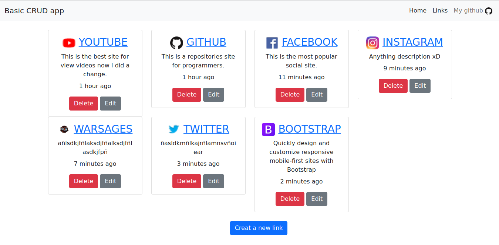

# Basic CRUD aplication
This is a simple application to create links, this is a practice with the Javascript language using nodejs and libraries following the faztcode tutorial [fastweb](https://www.faztweb.com/).

This application has a login authentication for user sessions.



# Requirements
To run the program we need to install the following tools:
- Nodejs v16.13.0
- npm v8.1.0
- MySQL v8.0.27

# Dependencies
- `package.json`
```json
{
    "dependencies": {
        "bcryptjs": "^2.4.3",
        "connect-flash": "^0.1.1",
        "express": "^4.17.1",
        "express-handlebars": "^5.3.5",
        "express-mysql-session": "^2.1.7",
        "express-session": "^1.17.2",
        "express-validator": "^6.13.0",
        "morgan": "^1.10.0",
        "mysql": "^2.18.1",
        "passport": "^0.5.0",
        "passport-local": "^1.0.0",
        "timeago.js": "^4.0.2"
    }
}
```
Run `npm install` to install all dependencies.
# Launch server
To launch the server run:
```bash
npm run dev
```
Now visit: http://localhost:4000

# Structure
```bash
.
├── database
│   └── db.sql
├── package.json
├── package-lock.json
├── README.md
└── src
    ├── ... # js files
    ├── lib
    │   └── handlebars.js
    ├── public
    │   ├── css
    │   └── js
    ├── routes
    │   ├── ... # js files
    └── views
        ├── index.hbs
        ├── layouts
        │   └── main.hbs
        ├── links
        │   ├── ... # hbs files
        └── partials
            └── navigation.hbs
```

# Programmer
* **Willy Paz**
